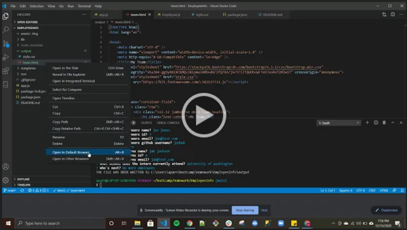

# EmployeeInfo
# ReadMeGen

  [](https://opensource.org/licenses/MIT)
  
  ## Table of Contents
  - [Description](#Description)
  - [Installation](#Installation)
  - [Usage](#Usage)
  - [Tools_&_Technologies](#Tools_&_Technologies)
  - [Code](#Code)
  - [License](#License)
  - [Repo_Link](#Repo_Link)
  - [Example](#Example)
  - [Author_Info](#Author_Info)

## Description
This application will allow you to build a software engineering team information page. When you run the application you will be asked a series of questions about your team. The manager will be the first team member you will need to provide information for. You will need to know their name, id, email and office number. After the manager information has been provided you will be prompted to choose among an engineer, intern or no more employees. You can build your team with as many engineers and/or interns you have. For the engineers you will be asked to provide a name, id, email and a Github username. The intern information you will need to provide is a name, id, email and school the intern is currently attending.

    Note: You will only need to do the installation once.

##  Installation
- Install node
- Download repo zip file
- Enter "npm i" in VSCode integrated terminal or GitBash/Terminal while in correct folder.

## Usage
### After install 
1. Open VSCode integrated terminal or GitBash/Terminal
2. Path to correct folder
3. Run file by entering "node app.js"
4. Answer prompted questions.

## Tools_&_Technologies
- JavaScript
- HTML
- CSS
- Node
- npm Inquirer

## Code
 Build information for manager
```JS
const managerInfo = () => {
    // console.log(employeeQuestions[0])
    return inquirer.prompt(employeeQuestions[0].managerQuestions).then((managerData) => {
        console.log(managerData)
        const newManager = new Manager(managerData.managerName, managerData.id, managerData.email, managerData.officeNumber)
        employeeList.push(newManager)
        // console.log(employeeList)
        askType()
    })
}

```
## Repo_Link
- [EmployeeInfo Repo](https://github.com/aparnell0130/EmployeeInfo)

## Example
#### Click picture to play video. For best quality, play video in full screen.

[](https://drive.google.com/file/d/1k2BV6iYAJSn30piNQkrGYsRc-hoGfUZ3/view)

## License
- MIT License

Copyright (c) [2020] [Aaron Parnell]

Permission is hereby granted, free of charge, to any person obtaining a copy of this software and associated documentation files (the "Software"), to deal in the Software without restriction, including without limitation the rights to use, copy, modify, merge, publish, distribute, sublicense, and/or sell copies of the Software, and to permit persons to whom the Software is furnished to do so, subject to the following conditions:

The above copyright notice and this permission notice shall be included in all copies or substantial portions of the Software.

THE SOFTWARE IS PROVIDED "AS IS", WITHOUT WARRANTY OF ANY KIND, EXPRESS OR IMPLIED, INCLUDING BUT NOT LIMITED TO THE WARRANTIES OF MERCHANTABILITY, FITNESS FOR A PARTICULAR PURPOSE AND NONINFRINGEMENT. IN NO EVENT SHALL THE AUTHORS OR COPYRIGHT HOLDERS BE LIABLE FOR ANY CLAIM, DAMAGES OR OTHER LIABILITY, WHETHER IN AN ACTION OF CONTRACT, TORT OR OTHERWISE, ARISING FROM, OUT OF OR IN CONNECTION WITH THE SOFTWARE OR THE USE OR OTHER DEALINGS IN THE SOFTWARE. 

## Author_Info
  Github: [aparnell0130](https://github.com/aparnell0130)  
  LinkedIn: [Aaron Parnell](https://www.linkedin.com/in/aaron-parnell-1ab4661b3/)  
  Email: aparnell0130@gmail.com

[Back to top](#ReadMeGen)
